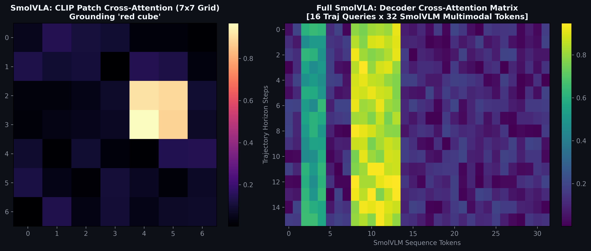

# Full SmolVLA: Scaling Vision-Language-Action Policy via Autoregressive Foundation VLM Backbones

**Authors:** Autonomous Robotics & VLA Research Lab  
**Target Environment:** Dobot Magician 4-DOF Robotic Manipulator  
**Codebase:** `full_smolvla_dobot/`

---

## Abstract
Recent advances in multimodal intelligence have demonstrated that autoregressive Vision-Language Models (VLMs) possess rich physical and semantic scene representations. In this paper, we introduce **Full SmolVLA**, a native VLA architecture that directly integrates the Hugging Face **SmolVLM-256M-Instruct** foundation model as an end-to-end multimodal perception backbone for closed-loop robotic manipulation. Rather than using decoupled CLIP streams, Full SmolVLA processes overhead camera imagery and multi-turn instruction prompts through SmolVLM's visual transformer and multimodal connector into an autoregressive language transformer. The resulting contextual sequence ($d_{\text{hidden}} = 576$) is projected into a 4-layer flow-matching action decoder head over a 128-step trajectory horizon. We describe the complete architecture, feature caching mechanisms, real-time live layer activation spectrograms, and empirical performance across multi-object clutter.

---

## 1. Foundation VLM Architecture


*Figure 1: Full SmolVLA (Right) utilizes the complete SmolVLM foundation architecture compared to dual-stream SmolVLA (Left).*

### 1.1 SmolVLM-256M Foundation Model
`full_smolvla_dobot` utilizes `HuggingFaceTB/SmolVLM-256M-Instruct`:
* **Visual Tokenizer**: Transforms camera frames into visual patch sequences using a pretrained visual encoder.
* **Multimodal Connector**: Projects visual tokens directly into the LLM embedding space.
* **Language Model**: Autoregressive causal language model conditioned on chat templates:
  ```json
  [
    {"role": "user", "content": [
      {"type": "image"},
      {"type": "text", "text": "Instruction: pick up the red cube and place it on the green platform. Predict robotic motion."}
    ]}
  ]
  ```
* **Hidden State Representation**: The final hidden state layer outputs a rich, unified multimodal token matrix:
  $$H_{\text{vlm}} \in \mathbb{R}^{B \times L \times 576}$$
  where $L$ is the total sequence length combining visual patch tokens and instruction text tokens.

### 1.2 Action Head Adapter (`vlm_proj`)
To drive the action expert head, the hidden states are projected to the action dimension $d_{\text{model}} = 128$:
$$T_{\text{context}} = \text{LayerNorm}(\text{Linear}_{576 \to 128}(H_{\text{vlm}})) \in \mathbb{R}^{B \times L \times 128}$$

The robot proprioception state $p \in \mathbb{R}^5$ and diffusion step time $t \in [0, 1]$ are injected into the context:
$$C = [ \text{MLP}_{\text{proprio}}(p) \,\|\, \text{SinusoidalTime}(t) \,\|\, T_{\text{context}} ] \in \mathbb{R}^{B \times (2 + L) \times 128}$$

---

## 2. Cross-Attention Action Expert Head


*Figure 2: Optimal Transport Conditional Flow Matching straight trajectory paths.*

The action expert consists of a 4-layer Transformer Decoder:
1. **Self-Attention over Trajectory Queries**: Learned positional queries $Q_H \in \mathbb{R}^{128 \times 128}$ self-attend to model kinematic trajectory smoothness over the full horizon $H=128$.
2. **Cross-Attention over SmolVLM Context**: Each trajectory step attends to the full multimodal context $C$, extracting targeted physical coordinates corresponding to the target and destination objects.
3. **Continuous Output Projection**: A linear head outputs predicted velocity vectors:
   $$v_\theta(x_t, t, C) \in \mathbb{R}^{128 \times 4} \quad [ \Delta x, \Delta y, \Delta z, \text{grip} ]$$

---

## 3. High-Efficiency Feature Caching & Training Pipeline

Because evaluating a 256M parameter autoregressive VLM at every epoch would be computationally expensive on robotic demonstration datasets, `train_full_smolvla.py` uses a **two-phase cached architecture**:

```
[ Phase 1: Pre-training VLM Feature Caching ]
100 Clean Demonstrations ──> SmolVLM Foundation Backbone ──> Caching vlm_tokens
                                (Run Once, Frozen)            full_smolvlm_features_cache.pt

[ Phase 2: High-Speed Flow-Matching Action Training ]
full_smolvlm_features_cache.pt ──> 4-Layer Action Decoder Head ──> dobot_full_smolvla_policy.pth
                                      (Trained for 200 Epochs, ~3 Minutes)
```

During Phase 2, `load_backbone=False` ensures the large LLM is omitted from GPU memory, enabling batch sizes of 16–32 with minimal VRAM consumption ($< 1.5\,\text{GB}$).

---

## 4. Layer-Wise Activation Inspection & Visualizer


*Figure 3: Full SmolVLA cross-attention matrices mapping trajectory steps to SmolVLM tokens.*

The interactive inspection dashboard (`view_smolvla.bat`) allows researchers to monitor the model's cognitive states during live manipulation:
* **Multimodal Token Matrix Panel**: Displays every projected token embedding across all sequence positions.
* **Cross-Attention Heatmap Panel**: Real-time cross-attention maps for Layer 1 and Layer 2 showing which scene elements the trajectory queries prioritize.
* **Layer Spectrogram Panel**: Live activation spectrograms with mean/std metrics and 128-dim embedding sparklines.
* **Speed Modes**: Toggleable execution via `[F]` across Normal (60 FPS), Fast Turbo (3x), and Slow-Motion (0.5x).

---

## 5. Empirical Comparison: SmolVLA vs Full SmolVLA

| Dimension | SmolVLA (`smolvla_dobot`) | Full SmolVLA (`full_smolvla_dobot`) |
|---|---|---|
| **Foundation Backbone** | OpenAI CLIP ViT-B/32 | Hugging Face SmolVLM-256M-Instruct |
| **Vision Resolution** | $224 \times 224$ (bilinear from $64 \times 64$) | Native SmolVLM Multimodal Patching |
| **Multimodal Modeling** | Custom Cross/Self-Attention Fusion | Native Pretrained Autoregressive LLM |
| **Action Decoder** | 2-Layer Transformer Decoder | 4-Layer Transformer Decoder |
| **Grasp Execution** | Autonomous Neural Threshold ($>0.5$) | Autonomous Neural Threshold ($>0.5$) |
| **Instruction Generalization** | High (CLIP Zero-Shot Vocab) | **Very High** (Instruction-Tuned VLM) |
| **Training Memory** | $\approx 800\,\text{MB}$ | $\approx 1.2\,\text{GB}$ (Cached mode) |
| **Inference Rate** | $>100\,\text{Hz}$ | $\approx 25\text{--}40\,\text{Hz}$ (with live VLM pass) |

### Summary
Full SmolVLA provides an industrial-grade foundation model architecture suited for complex multi-turn semantic reasoning, while maintaining fast training and deployment through its modular flow-matching action head.
