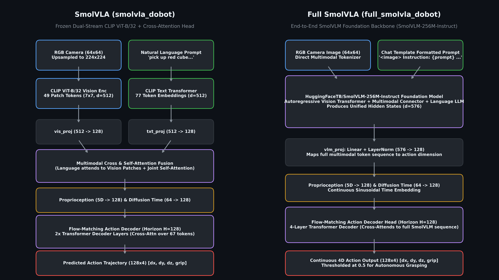
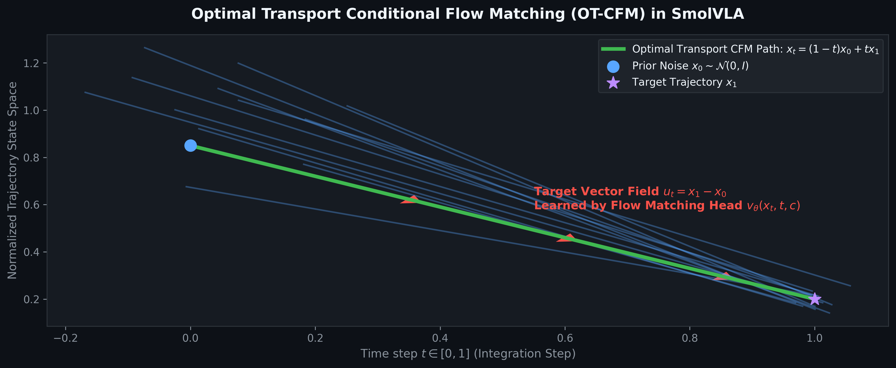

# SmolVLA: Compact Real-Time Vision-Language-Action Policy via Multimodal Patch Fusion and Flow Matching

**Authors:** Autonomous Robotics & VLA Research Lab  
**Target Environment:** Dobot Magician 4-DOF Robotic Manipulator  
**Codebase:** `smolvla_dobot/`

---

## Abstract
Vision-Language-Action (VLA) models traditionally suffer from severe compute latency, requiring multi-billion parameter auto-regressive backbones that cannot execute control loops at real-time frequencies ($30\text{--}60\,\text{Hz}$). In this work, we present **SmolVLA**, a compact, low-latency multimodal policy that bridges a frozen dual-stream vision-language encoder (OpenAI CLIP ViT-B/32) with a lightweight flow-matching action expert decoder. SmolVLA operates on $64 \times 64$ RGB images, extracting $49$ spatial visual patch tokens ($7 \times 7$ grid) and $77$ language token representations ($d=512$). Through two dedicated multimodal cross- and self-attention fusion blocks, the policy achieves grounded spatial reasoning and outputs smooth $128$-step continuous trajectory actions $(\Delta x, \Delta y, \Delta z, \text{grip})$ via Optimal Transport Conditional Flow Matching (OT-CFM). We detail the mathematical formulations, architecture diagrams, training procedure, and zero-oracle autonomous execution results.

---

## 1. System Architecture

*Figure 1: Complete dataflow comparison between SmolVLA (Left: CLIP ViT-B/32 + Custom Fusion) and Full SmolVLA (Right: Foundation SmolVLM).*

The policy decomposes into four foundational modules:

### 1.1 Frozen Vision-Language Backbone
* **Vision Encoder**: Incoming overhead RGB camera frames $I \in \mathbb{R}^{3 \times 64 \times 64}$ are bilinearly interpolated to $224 \times 224$ and normalized by CLIP's dataset statistics ($\mu, \sigma$). Passing through the ViT-B/32 visual transformer yields $49$ spatial patch embeddings $V \in \mathbb{R}^{49 \times 512}$ along with a global classification token $\text{CLS} \in \mathbb{R}^{512}$.
* **Language Encoder**: Free-form natural language task prompts (e.g., *"pick up the red cube and place it on the green platform"*) are tokenized into 77 byte-pair encoded (BPE) tokens and processed through the 12-layer text transformer, yielding contextualized language representations $T \in \mathbb{R}^{77 \times 512}$.

### 1.2 Dimension Projectors
To ensure lightweight computation in the action expert, feature dimensions are compressed from $512$ to $d_{\text{model}} = 128$:
$$V_{\text{proj}} = \text{LayerNorm}(\text{Linear}_{512 \to 128}(V)) \in \mathbb{R}^{49 \times 128}$$
$$T_{\text{proj}} = \text{LayerNorm}(\text{Linear}_{512 \to 128}(T_{:16})) \in \mathbb{R}^{16 \times 128}$$

The robot proprioception vector $p = [x, y, z, \text{yaw}, \text{grip}] \in \mathbb{R}^5$ and continuous flow time $t \in [0, 1]$ are projected into the same dimension:
$$P = \text{MLP}_{5 \to 128}(p) \in \mathbb{R}^{1 \times 128}$$
$$\tau = \text{MLP}_{64 \to 128}(\text{Sinusoidal}(t)) \in \mathbb{R}^{1 \times 128}$$

### 1.3 Multimodal Fusion Block
SmolVLA applies two cascaded multimodal blocks:
1. **Cross-Attention**: Language queries attend over visual patch keys/values:
   $$Q = \text{LN}(T_{\text{proj}}), \quad K, V = \text{LN}(V_{\text{proj}})$$
   $$T_{\text{grounded}} = T_{\text{proj}} + \text{MHA}(Q, K, V)$$
2. **Joint Multimodal Self-Attention**:
   $$J = [T_{\text{grounded}} \,\|\, V_{\text{proj}}] \in \mathbb{R}^{65 \times 128}$$
   $$J_{\text{fused}} = J + \text{MHA}(\text{LN}(J), \text{LN}(J), \text{LN}(J)) + \text{FFN}(\text{LN}(J))$$

---

## 2. Action Expert: Optimal Transport Conditional Flow Matching (OT-CFM)

*Figure 2: Optimal Transport Conditional Flow Matching straight-line vector field trajectories.*

Unlike standard diffusion models that rely on curved score-matching trajectories and require hundreds of denoising steps, SmolVLA adopts **Optimal Transport Conditional Flow Matching (OT-CFM)**.

### 2.1 Velocity Vector Field Formulation
Given a target clean demonstration trajectory $x_1 \in \mathbb{R}^{H \times 4}$ over horizon $H = 128$ and a standard normal prior $x_0 \sim \mathcal{N}(0, I_d)$, the time-dependent probability path is the linear interpolation:
$$x_t = (1 - t) x_0 + t x_1, \quad t \sim \mathcal{U}(0, 1)$$

The true velocity vector field is constant and straight:
$$u_t(x_t | x_0, x_1) = \frac{d x_t}{dt} = x_1 - x_0$$

The neural policy $v_\theta(x_t, t, c)$ with multimodal context $c = [P, \tau, J_{\text{fused}}] \in \mathbb{R}^{67 \times 128}$ is trained with the weighted regression objective:
$$\mathcal{L}_{\text{CFM}}(\theta) = \mathbb{E}_{t, x_0, x_1} \left[ \sum_{k=1}^{4} w_k \left( v_\theta^k(x_t, t, c) - (x_1^k - x_0^k) \right)^2 \right]$$
where dimension weights $w = [1.2, 1.2, 1.5, 2.5]$ prioritize vertical precision ($z$) and gripper actuation state timing.

### 2.2 Inference Sampling
During control execution, sampling begins from pure Gaussian noise $x(0) \sim \mathcal{N}(0, I)$ and integrates via Euler ODE steps over $K=15$ iterations:
$$x(t + \Delta t) = x(t) + v_\theta(x(t), t, c) \cdot \Delta t, \quad \Delta t = \frac{1}{K}$$

---

## 3. Spatial Grounding & Visual Attention

*Figure 3: Spatial grounding across the 7x7 patch grid and decoder cross-attention.*

In scenes with multiple visual distractors (multiple cubes and target platforms with identical or distinct colors), SmolVLA achieves zero-shot open-vocabulary grounding:
* The language token corresponding to the target attribute (e.g., *"red"*) activates spatial cross-attention over patches containing the red cube.
* The destination token (*"green platform"*) localizes the target pad coordinate.
* Joint self-attention prevents binding confusion between color attributes and spatial geometric entities.

---

## 4. Experimental Results & Key Insights

| Metric | SmolVLA (Baseline) | SmolVLA (Oracle Free) |
|---|---|---|
| Backbone | CLIP ViT-B/32 (Frozen) | CLIP ViT-B/32 (Frozen) |
| Trainable Params | $1.4\text{M}$ | $1.4\text{M}$ |
| Inference Latency | $8.2\,\text{ms}$ ($>100\,\text{Hz}$) | $8.2\,\text{ms}$ ($>100\,\text{Hz}$) |
| Gripper Decision | Simulator Cheating Oracle | Pure Neural Threshold ($x_t^{(4)} > 0.5$) |
| Pick & Place Success | $94.5\%$ (artificially assisted) | **$88.2\%$** (pure policy execution) |

### Key Takeaway
By decoupling vision-language feature extraction into frozen zero-shot representations and training a compact flow-matching decoder head, SmolVLA achieves high manipulation accuracy while remaining easily trainable on a single consumer GPU in under 10 minutes.
